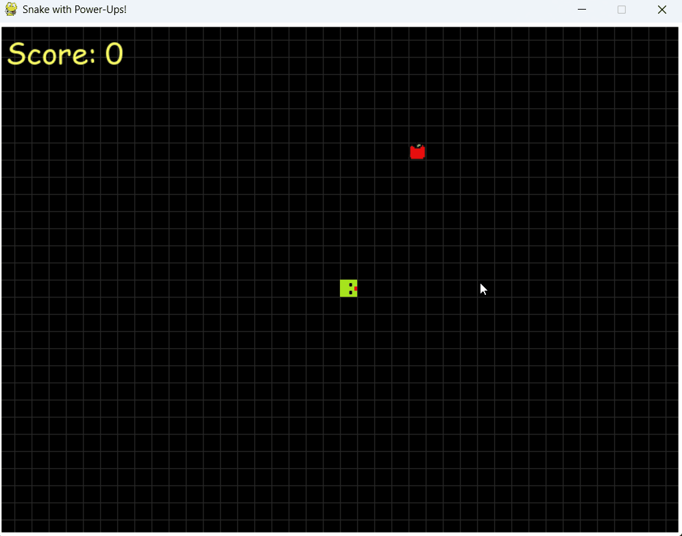

# Snake with Power-Ups!

A classic Snake game built with Python and Pygame, featuring a full graphical overhaul, a high-score system, and exciting power-ups!

## Gameplay Demo



## Features

- **Classic Snake Gameplay:** Navigate the snake to eat apples and grow longer.
- **Dynamic Power-Up System:** Adds excitement and strategy with timer-based power-ups that spawn every 10 seconds.
- **Two Power-Up Types:**
  - **Slow-Mo:** Slows down time for 10 seconds to navigate tight spots!
  - **Bonus Apple:** Instantly grants an extra point.
- **High-Score System:** Your highest score is automatically saved to a local file and displayed on the main menu.
- **Polished UI:** Features a main menu, in-game score display, and a game-over screen with a visible grid and border.

## Controls

| Action            | Key            |
| :---------------- | :------------- |
| **Move Up**       | Up Arrow       |
| **Move Down**     | Down Arrow     |
| **Move Left**     | Left Arrow     |
| **Move Right**    | Right Arrow    |
| **Start/Restart** | Space or Enter |

## Stable Release

You can download the latest stable version (v1.0.0) from the [Releases Page](https://github.com/JonnIsAwayy/pygame-snake-game/releases/latest). This includes the source code packaged for the most recent milestone.

## How to Run

1.  **Clone the repository:**
    ```bash
    git clone [https://github.com/YOUR_USERNAME/YOUR_REPOSITORY.git](https://github.com/YOUR_USERNAME/YOUR_REPOSITORY.git)
    ```
2.  **Navigate to the project directory:**
    ```bash
    cd YOUR_REPOSITORY
    ```
3.  **Create and activate a virtual environment:**
    ```bash
    python -m venv .venv
    source .venv/bin/activate  # On Windows, use: .venv\Scripts\activate
    ```
4.  **Install the required libraries:**
    ```bash
    pip install -r requirements.txt
    ```
5.  **Run the game!**
    ```bash
    python main.py
    ```

---

_Developed by [JonnIsAwayy](https://github.com/JonnIsAwayy)_
